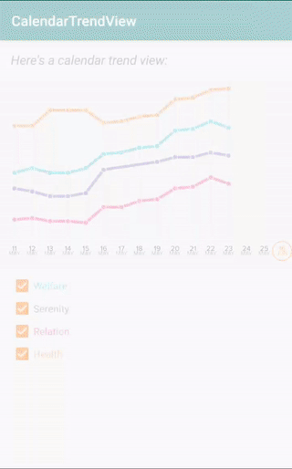

CalendarTrendView
=================

[](https://opensource.org/licenses/Apache-2.0) [](http://developer.android.com/index.html) [](https://android-arsenal.com/api?level=16) [ ](https://bintray.com/lukelorusso/maven/com.lukelorusso:calendartrendview/1.1.6/link)

## Presentation ##



This is the source code of an Android library: `-=:[ CalendarTrendView ]:=-`  
Show a cartesian trend graph based on calendar dates

This library make use of [SimplePaperView](https://github.com/lukelorusso/SimplePaperView) to draw shapes!

- - -

## Why would you need it? ##

Let's say you want to represent one or more behaviours.  
By "behaviour" I mean a list of events, happening once per day, evaluated as Float numbers in the range of `0.0` to `10.0` (percentage; you can change min and max values 😉).  
It would be useful to show a trend of how this events evolve as the days pass by.

With CalendarTrendView you can show a meaningful "trend graph" (a cartesian x,y board) that tracks the evolution of your behaviours.

In this example you see the evolution of 4 behaviours, or "Trends".  
Each `Trend` is a class with:  
* a label
* an `HashMap<String, Float?>` where `String` is a date in a predefined format pattern
* a color
* [optional] the weight (thickness) of our line in dp

- - -

## How to use it? ##

Make sure to include the library in your app's build.gradle:

```groovy
    implementation 'com.lukelorusso:calendartrendview:1.1.6'
```  

Add the view to your layout:
```xml
<com.lukelorusso.calendartrendview.CalendarTrendView
        android:id="@+id/calendarTrendView"
        android:layout_width="wrap_content"
        android:layout_height="wrap_content"/>
```  

maybe add some colors, set if you need to show today or not... you may also want to put x and y unit measures:
```
        ...
        android:background="@color/graphBackground"
        app:ctv_dayLabelColor="@color/graphTextLabelDay"
        app:ctv_monthLabelColor="@color/graphTextLabelMonth"
        app:ctv_todayLabelColor="@color/colorAccent"
        app:ctv_stepLineColor="@color/graphStepLine"
        app:ctv_showToday="true"
        app:ctv_startFrom="nowhere"
        app:ctv_xUnitMeasure="25dp"
        app:ctv_yUnitMeasure="22dp"
        ...
```  

- - -

# Attributes #

Ok by now, let's move to the code!    
This is a `Trend`:
```kotlin
val trend = CalendarTrendView.Trend(
    "Precipitations",
    hashMapOf(
        "2019-05-11" to 4F,
        "2019-05-12" to 4.3F,
        "2019-05-13" to 4F,
        "2019-05-14" to 4F,
        "2019-05-15" to 4.3F
    ),
    Color.RED
)
```  

You can also define a `List<Trend>` to show.  
Remember that your value is a Float, but can also be unknown (null).

Let's customize our view a little more:  
```kotlin
calendarTrendView.numberOfDaysToShowAtLeast = 14
calendarTrendView.maxValue = 1000F // you may want to customize this...
calendarTrendView.minValue = 100F // ...or that
calendarTrendView.xUnitMeasureInDp = context.dpToPixel(25F) // if you don't like...
calendarTrendView.yUnitMeasureInDp = context.dpToPixel(22F) // ...using XML attributes
calendarTrendView.labelTypeFace = ResourcesCompat.getFont(this, R.font.proxima_nova_regular) // you can choose a font for days' labels
calendarTrendView.lineWeightsInDp = 4F // the global "thickness"; however, each Trend can override this with its own lineWeightsInDp
```  

If you need to adopt another date format just let the view know it:
```kotlin
calendarTrendView.dateFormatPattern = "dd/MM/yyyy" // or any other pattern you like
```  

Time to add our Trend:
```kotlin
calendarTrendView.addTrend(trend)
```  

...or our list of trends:
```kotlin
calendarTrendView.setTrends(trendList)
```  

Other useful methods:
```kotlin
calendarTrendView.removeTrend(trend)

calendarTrendView.removeTrendAt(0)

calendarTrendView.removeTrendByLabel("Precipitations")

calendarTrendView.clearTrends()
```  

If you need all the represented LocalDate in the graph:
```kotlin
val setOfDates = calendarTrendView.getUniqueDates()
```  

This is a useful way to get today's LocalDate:
```kotlin
val todayLocalDate = todayToLocalDate()
```  

- - -

# Explore! #

Feel free to checkout and launch the example app 🎡

- - -

# Copyright #

Make with 💚 by [Luca Lorusso](http://lukelorusso.com), licensed under [Apache License 2.0](http://www.apache.org/licenses/LICENSE-2.0)
